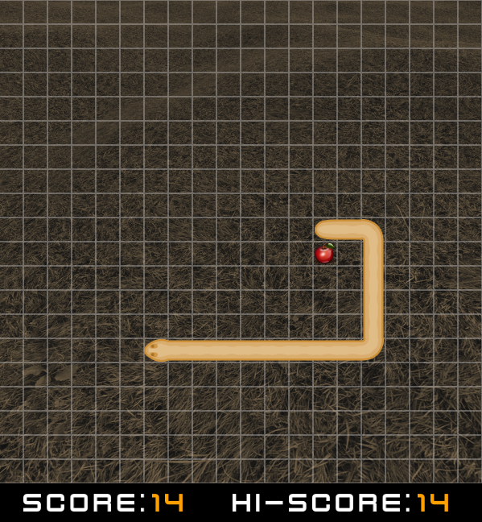

# Snake

_Snake game written in Rust_

Commands to build/run:

>_All commands execute from the parent folder (where the "Cargo.toml" file exists)_

To build: 
```shell
cargo build --release
```
>_do not forget to copy binary file next to the assets folder before execution_

To run: 
```shell
cargo run
```
## Screenshot

